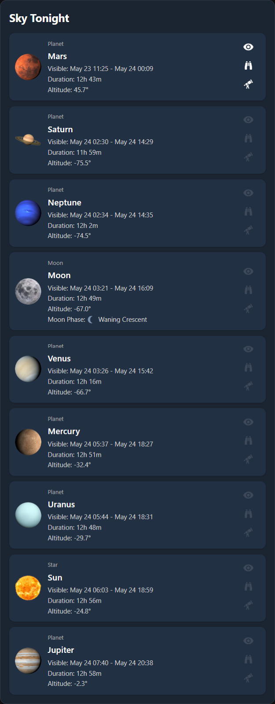

# Sky Tonight Card

[](https://github.com/wwwescape/sky-tonight-card/releases)
[](https://github.com/wwwescape/sky-tonight-card/commits/master)
[](https://github.com/wwwescape/sky-tonight-card)
[](https://github.com/hacs/default)


#### A Home Assistant card showing sun, moon, and planet visibility using [Astronomy Engine](https://github.com/cosinekitty/astronomy)




## Installation


### HACS install
1. Open HACS.
2. Click on the three dot menu in the top right corner of the screen → "Custom Repositories"
3. Paste https://github.com/wwwescape/sky-tonight-card in the Repositories textbox and select Dashboard in the Type dropdown.
4. Click Add.
5. Search for 'Sky Tonight Card' and click the three dot menu besides it.
6. Click Download.
7. Finally, refresh your browser window.


### Manual install
1. Navigate to your `<config>/www/` folder inside your Home Assistant installation and create a new folder named `sky-tonight-card`.
2. Manually download [sky-tonight-card.js](https://github.com/wwwescape/sky-tonight-card/releases/latest/download/sky-tonight-card.js).
3. Place the file inside the `sky-tonight-card` folder you created in step 1.
4. Add the following to your `configuration.yaml` file:
  ```yaml
  lovelace:
    resources:
      - url: /local/sky-tonight-card/sky-tonight-card.js
        type: module
  ```
5. Alternately, go to `Settings` -> `Dashboards`. Then in the top right corner, click the 3 dots icon and click `Resources`. Click the `+ Add Resource` button in the bottom right corner. Add `/local/sky-tonight-card/sky-tonight-card.js` as the `URL` and choose `JavaScript Module` as the `Resource Type`. Click `Create`.
6. Finally, refresh your browser window.

**Note:** The url path may need to be adjusted to reflect the location of your configuration direction, as seen from the running system.  For example on some HAAS systems it will appear to be `/root/config/www/sky-tonight-card/sky-tonight-card.js`  (i.e /root/config instead).


## Configuration

| Name                  | Type          | Default                               | Description                                                                                                                     |
| --------------------- | ------------- | ------------------------------------- | ------------------------------------------------------------------------------------------------------------------------------- |
| type                  | string        | **Required**                          | `custom:sky-tonight-card`                                                                                                       |
| title                 | string        | `Sky Tonight`                         | Title of the card                                                                                                               |
| latitude              | number        |                                       | Latitude of the observer (uses Home Assistant config if not specified)                                                          |
| longitude             | number        |                                       | Longitude of the observer (uses Home Assistant config if not specified)                                                         |
| elevation             | number        | `0`                                   | Elevation of the observer in metres above sea level                                                                             |
| languageOverride      | string        |                                       | Override language (options: "en", "hi", "fr" - uses Home Assistant language if not specified)                                   |
| showBelowHorizon      | boolean       | `false`                               | Set to true to display planetary bodies below the horizon as well                                                               |
| showSun               | boolean       | `true`                                | Set to false to hide the Sun                                                                                                    |
| showConfiguration     | boolean       | `true`                                | Set to false to hide the configuration section in the card                                                                      |
| colors                | object        |                                       | Object containing color overrides (see [Color Customization](#color-customization) below)                                       |

### Color Customization

You can customize the card's appearance by providing a `colors` object with any of these properties:

| Property             | Default       | Description                                                                                                                     |
| -------------------- | ------------- | ------------------------------------------------------------------------------------------------------------------------------- |
| cardBackground       | `#1b2431`     | Background color of the card                                                                                                    |
| cardTitle            | `#ffffff`     | Color of the card title                                                                                                         |
| objectBackground     | `#223044`     | Background color of each object's container                                                                                     |
| objectName           | `#ffffff`     | Color of the object's name                                                                                                      |
| objectData           | `#cccccc`     | Color of the object's data (right side text)                                                                                    |
| objectType           | `#aaaaaa`     | Color of the object's type text                                                                                                 |

### Example Configuration

```yaml
type: custom:sky-tonight-card
cardTitle: Objects in the sky
latitude: 40.7128
longitude: -74.0060
elevation: 10
showBelowHorizon: false
showSun: true
showConfiguration: true
languageOverride: "en"
colors:
  cardBackground: "#1b2431"
  cardTitle: "#ffffff"
  objectBackground: "#223044"
  objectName: "#ffffff"
  objectData: "#cccccc"
  objectType: "#aaaaaa"
```


## Adding Translations

1. Duplicate `translation-template.ts` as `[lang-code].ts`
2. Fill in all string values
3. Add the language to `translations/index.ts`
4. Submit pull request
